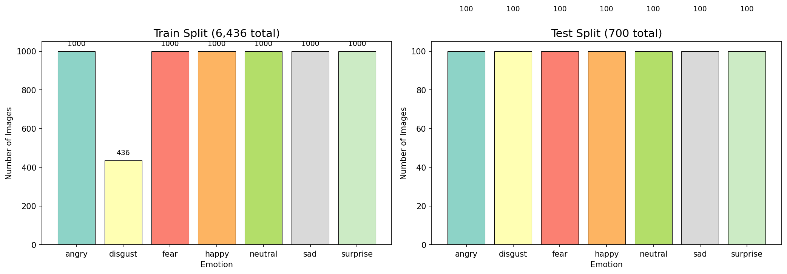
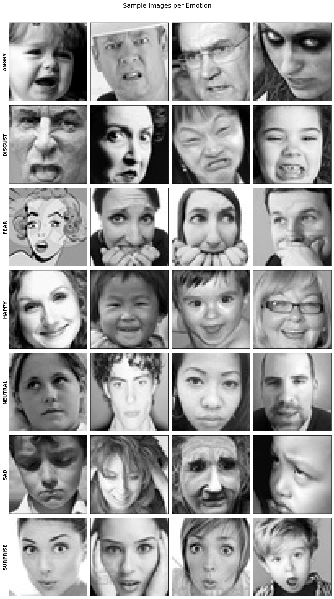

# Embodied Agents: Vision-Language Study Buddy Robot

**EE3180 Design & Innovation Project — Nanyang Technological University**

---

## Overview

This project builds an **emotionally aware study buddy robot** — an embodied AI agent that perceives a student's facial expression through a camera, recognises their emotion, and responds with empathetic, context-appropriate study guidance in natural language. The entire perception-to-response pipeline runs within a single vision-language model deployed on a **Raspberry Pi 5**, making the system fully self-contained and edge-deployable with no cloud dependency.

The core model is [**Qwen2.5-VL-3B**](https://huggingface.co/Qwen/Qwen2.5-VL-3B-Instruct) fine-tuned with **QLoRA** on the FER-2013 facial expression dataset, then quantised to **GGUF Q4\_K\_M** (~3.1 GB) for efficient on-device inference via [Ollama](https://ollama.com/).

---

## Key Components

| Component | Description |
|---|---|
| **Vision Perception** | Pi Camera captures student faces; SigLIP vision encoder (frozen) extracts visual features |
| **Multimodal Reasoning** | Qwen2.5-VL-3B performs joint emotion classification + empathetic response generation in a single forward pass |
| **Speech Interface** | Whisper / faster-whisper (INT8) for speech-to-text; gTTS / eSpeak for text-to-speech |
| **Robot Interaction** | Tkinter GUI with live video feed, voice input, and text chat on Raspberry Pi |
| **Hardware Sensing** | PIR motion sensor (GPIO) triggers camera capture for hands-free activation |
| **Fine-Tuning Pipeline** | End-to-end QLoRA training, GGUF export, and evaluation scripts |

### Emotion Classes

The model recognises **7 facial expressions**: `angry` · `disgust` · `fear` · `happy` · `neutral` · `sad` · `surprise`

---

## System Architecture

```
┌─────────────────────────────────────────────────────────────┐
│                    Raspberry Pi 5 (16 GB)                   │
│                                                             │
│  ┌──────────┐   ┌──────────────┐   ┌──────────────────┐    │
│  │ Pi Camera│──▶│ Vision Encoder│──▶│  Qwen2.5-VL-3B   │   │
│  │          │   │  (SigLIP F16) │   │  (Q4_K_M LoRA)   │   │
│  └──────────┘   └──────────────┘   │                    │   │
│                                     │  Emotion + Reply  │   │
│  ┌──────────┐                      │  ──────────────▶  │   │
│  │   Mic    │──▶ Whisper STT ─────▶│  Conversational   │   │
│  └──────────┘                      │  study guidance    │   │
│                                     └────────┬─────────┘   │
│  ┌──────────┐                               │              │
│  │ PIR Sensor│─── GPIO trigger              ▼              │
│  └──────────┘                         gTTS / Speaker       │
│                                                             │
│                     Ollama Runtime                          │
└─────────────────────────────────────────────────────────────┘
```

---

## Performance

| Metric | Value |
|--------|-------|
| **Test Accuracy** | **63.3%** (competitive with FER-2013 human agreement of ~65%) |
| Best Classes | disgust (85.7%), surprise (85.7%) |
| Training Loss | 0.1028 → Eval Loss 0.0989 (no overfitting) |
| Training Time | ~4.5 hours on NVIDIA RTX 2080 Ti (11 GB VRAM) |
| Quantised Model Size | ~3.1 GB (language 1.8 GB + vision encoder 1.3 GB) |
| Trainable Parameters | 74.3M / 3.83B (1.94%) via LoRA rank-32 |
| Pi 5 Inference | ~2–5 tokens/sec, 5–15 s first-token latency with image |

---

## Dataset & Training Visualisations

<p align="center">
  
  
</p>

> **Left:** Train/test class distribution across 7 emotions (with disgust oversampling).
> **Right:** Sample 48×48 grayscale FER-2013 images per emotion class.

---

## Technologies

| Category | Stack |
|----------|-------|
| **Base Model** | Qwen2.5-VL-3B-Instruct |
| **Fine-Tuning** | Unsloth, QLoRA, PEFT, TRL (SFTTrainer), bitsandbytes |
| **ML Framework** | PyTorch, HuggingFace Transformers, Accelerate |
| **Quantisation** | GGUF Q4\_K\_M via llama.cpp (through Unsloth) |
| **Inference** | Ollama |
| **Vision** | OpenCV, Picamera2, Pillow |
| **Speech** | OpenAI Whisper, faster-whisper, gTTS, pyttsx3, eSpeak |
| **GUI** | Tkinter, Streamlit |
| **Hardware** | Raspberry Pi 5 (16 GB), Pi Camera Module, PIR sensor, USB Mic |
| **Dataset** | FER-2013 (35k images, 7 emotions) |
| **Language** | Python 3.10+ |

---

## Fine-Tuning Pipeline

The full fine-tuning guide is in **[docs/FINETUNE\_README.md](docs/FINETUNE_README.md)**.

```bash
cd finetuning/
python 01_explore_dataset.py          # 1. Analyse FER-2013 dataset statistics
python 02_prepare_finetune_data.py    # 2. Preprocess images + build JSONL (with augmentation)
python 03_finetune_qwen3vl_lora.py    # 3. QLoRA fine-tuning (~4.5 hours, 11 GB VRAM)
python 04_export_model.py             # 4. Merge LoRA → GGUF Q4_K_M for Raspberry Pi
python 05_evaluate_test_accuracy.py   # 5. Evaluate test accuracy + confusion matrix
```

### Pipeline Details

| Step | Script | What It Does |
|------|--------|--------------|
| 1 | `01_explore_dataset.py` | Analyses FER-2013: class counts, image properties (48×48 grayscale), generates distribution plots |
| 2 | `02_prepare_finetune_data.py` | Upscales images to 224×224 RGB, oversamples disgust (436→1000) with augmentation, generates JSONL with 12 diverse prompts and 3–4 empathetic responses per emotion |
| 3 | `03_finetune_qwen3vl_lora.py` | QLoRA (4-bit NF4, rank=32, alpha=64) via Unsloth + SFTTrainer — 2× faster, 60% less VRAM |
| 4 | `04_export_model.py` | Merges LoRA weights → 16-bit → GGUF Q4\_K\_M; generates `Modelfile` and `run_studybuddy.py` |
| 5 | `05_evaluate_test_accuracy.py` | Per-class accuracy, confusion matrix, precision / recall / F1 on stratified test set |

---

## Fine-Tuned Weights

📥 **[Download GGUF Weights & LoRA Adapter (OneDrive)](https://entuedu-my.sharepoint.com/my?id=%2Fpersonal%2Fshreyas010%5Fe%5Fntu%5Fedu%5Fsg%2FDocuments%2FEE3180&ga=1)**

| File | Size | Description |
|------|------|-------------|
| `qwen2.5-vl-3b-instruct.Q4_K_M.gguf` | 1.8 GB | Quantised language model |
| `qwen2.5-vl-3b-instruct.F16-mmproj.gguf` | 1.3 GB | Vision encoder (SigLIP) |

---

## Quick Deploy on Raspberry Pi

```bash
# 1. Install Ollama
curl -fsSL https://ollama.com/install.sh | sh

# 2. Download studybuddy_gguf/ from OneDrive (link above)
#    Copy to Pi along with Modelfile and run_studybuddy.py

# 3. Create & run the model
cd ~/studybuddy
ollama create studybuddy -f Modelfile
python run_studybuddy.py              # Camera-based emotion detection + response
```

**Expected performance on Pi 5 (16 GB):** ~30–60 s model load, ~2–5 tokens/sec, ~3–4 GB RAM usage.

---

## Prototype Evolution

The project went through multiple development stages, each adding new capabilities:

| Stage | Directory | Description |
|-------|-----------|-------------|
| **Phase 0** | `prototypes/phase0_streamlit/` | Streamlit web app using HuggingFace cloud API (Qwen2-VL-7B) for qualitative emotion probing with 4 prompt strategies |
| **Stage 1.0–1.5** | `prototypes/qwen3_vl_4b/Stage1_Milestones/` | Incremental modality integration on macOS: text chat → vision → voice (Whisper) → combined GUI with TTS → async streaming |
| **Stage 2.0** | `prototypes/qwen3_vl_4b/Stage2_Milestones/` | Platform-specific builds (macOS / Raspberry Pi), live video feed, distributed Pi → Mac inference |
| **Stage 2.1** | `prototypes/qwen3_vl_4b/stage2.1_linux_oop.py` | Final OOP architecture — 4 modular classes: `RemoteBrain`, `VisionSystem`, `AudioSystem`, `StudyBuddyApp` |
| **Hardware Tests** | `prototypes/modular_codes/` | Standalone tests for Pi Camera, PIR motion sensor (GPIO), and Ollama API |
| **Fine-Tuning** | `finetuning/` | QLoRA on FER-2013 → GGUF export → standalone on-device inference (no Mac server needed) |

---

## Repository Structure

```
├── README.md                          # This file
├── LICENSE                            # MIT License
│
├── docs/                              # Documentation
│   ├── FINETUNE_README.md             #   Comprehensive fine-tuning & deployment guide
│   └── howtoaccessgpu.md              #   NTU GPU cluster access instructions
│
├── finetuning/                        # Fine-tuning pipeline (5 sequential scripts)
│   ├── 01_explore_dataset.py          #   Dataset analysis & visualisation
│   ├── 02_prepare_finetune_data.py    #   Image preprocessing + JSONL generation
│   ├── 03_finetune_qwen3vl_lora.py    #   QLoRA training with Unsloth
│   ├── 04_export_model.py             #   LoRA merge + GGUF quantisation
│   ├── 05_evaluate_test_accuracy.py   #   Test evaluation + confusion matrix
│   ├── requirements.txt               #   Python dependencies
│   ├── training_log.txt               #   Full training console output (2,364 steps)
│   └── assets/                        #   Distribution plots & sample image grids
│
├── prototypes/                        # Development prototypes (chronological)
│   ├── phase0_streamlit/              #   Streamlit + HuggingFace cloud API prototype
│   ├── qwen3_vl_4b/                   #   Stage 1–2 milestone builds
│   │   ├── Stage1_Milestones/         #     Chat, vision, voice, GUI integration
│   │   ├── Stage2_Milestones/         #     Platform-specific + distributed inference
│   │   ├── Troubleshooting codes/     #     Benchmarking & debugging utilities
│   │   └── stage2.1_linux_oop.py      #     Final OOP architecture
│   └── modular_codes/                 #   Camera, PIR sensor, Ollama hardware tests
│
├── scripts/                           # GPU server training infrastructure
│   ├── train_lora.py                  #   Earlier training script (7B model)
│   ├── check_gpu.py                   #   GPU memory checker
│   ├── setup_gpu_server.ps1           #   NTU GPU cluster setup script
│   ├── start_training.sh              #   Auto-detect GPU & launch training
│   └── check_server.sh               #   Server environment diagnostics
│
├── tests/                             # Hardware validation scripts
│   ├── sr_test.py                     #   Microphone / SpeechRecognition test
│   └── whisper_test.py                #   Whisper STT test
│
└── data/
    └── finetune_data/                 # Generated training data
        ├── train.jsonl                #   6,300 training samples
        ├── val.jsonl                  #   700 validation samples
        ├── test.jsonl                 #   700 test samples
        └── examples_preview.json      #   5 sample entries for inspection
```

---

## License

This project is licensed under the [MIT License](LICENSE).
